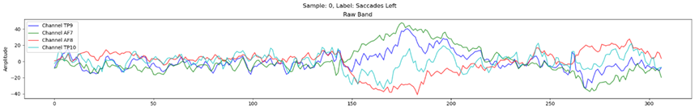
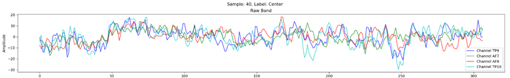
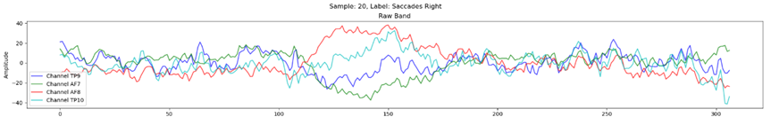

## English

# EEG Eye Movement Dataset

This dataset contains EEG (Electroencephalography) data recorded during activities related to eye movement in three main forms: looking to the left, looking straight (normal), and looking to the right. The data was collected from 25 participants aged between 20-30 years. The dataset is structured systematically for easy access and use in research, especially in fields related to Brain-Computer Interface (BCI), Machine Learning, and Deep Learning in the context of eye movement analysis.

### Data Pre-processing

- **Filtering signals in the frequency range of 8-100Hz**: The signals were filtered to retain the frequency range important for EEG analysis. This range is typically associated with eye movements and related brain activities, ensuring that irrelevant data is filtered out.
- **Reducing 50Hz interference**: To reduce interference from electrical devices operating at 50Hz, which is the standard power supply frequency, filtering was applied in the range of 48-52Hz to remove unwanted noise.
- **Segmenting data into windows (Windowing)**: The data was segmented into windows of 307 samples, with each window containing 256 samples from the latest 1 second of data and 51 samples from the preceding data. This method helps to obtain continuous data and effectively capture the changes in EEG signals.

### Dataset Structure

The dataset is organized as follows:

```
EEG_EyeMovement_Dataset
├── Combined_Subjects
│   ├── Combined_X.npy
│   └── Combined_y.npy
├── Individual_Subjects
│   ├── S1
│   │   ├── X_raw_S1.npy
│   │   └── Y_S1.npy
│   ├── S2
│   │   ├── X_raw_S2.npy
│   │   └── Y_S2.npy
│   └── ...
├── Selected_Data
│   ├── Selected_X.npy
│   └── Selected_y.npy
```

### Folder Descriptions:

- **Individual_Subjects**: Contains EEG data for each participant (`S1`, `S2`, ...). Each participant's folder includes `X_raw` for EEG signals and `Y` for labels.
- **Combined_Subjects**: Contains the combined dataset of all participants, with `Combined_X.npy` representing EEG signals and `Combined_y.npy` representing labels.
- **Selected_Data**: Contains data selected from `Combined_Subjects` after preliminary quality checks.

### Data Format

- **X_raw_S#.npy**: Numpy array file containing raw EEG data for each participant.
- **Y_S#.npy**: Numpy array file containing labels corresponding to the EEG data ("Saccades Left", "Center", "Saccades Right").

### Sample Data

- Looking to the left



- Looking straight (normal)



-  Looking to the right



### Usage

The dataset can be loaded using the following Python code:

```
import numpy as np

# Load combined data
X_combined = np.load('Combined_Subjects/Combined_X.npy')
y_combined = np.load('Combined_Subjects/Combined_y.npy')

# Load data for individual participants (e.g., Participant 1)
X_S1 = np.load('Individual_Subjects/S1/X_raw_S1.npy')
y_S1 = np.load('Individual_Subjects/S1/Y_S1.npy')
```

### Requirements

- Numpy

Install the required package:

```
pip install numpy
```

### Dataset Reference

Jiraphat-DEV. (2024). BCIPI. GitHub repository. https://github.com/Jiraphat-DEV/BCIPI

## ภาษาไทย

# EEG Eye Movement Dataset

ชุดข้อมูลนี้ประกอบด้วยข้อมูล EEG (Electroencephalography) ที่บันทึกระหว่างการทำกิจกรรมที่เกี่ยวข้องกับการเคลื่อนไหวของดวงตาในสามรูปแบบหลัก ได้แก่ การมองไปทางซ้าย การมองตรงกลาง (ปกติ) และการมองไปทางขวา ข้อมูลนี้รวบรวมจากกลุ่มตัวอย่างจำนวน 25 คน ที่มีอายุระหว่าง 20-30 ปี โดยมีการจัดโครงสร้างข้อมูลอย่างเป็นระบบเพื่อความสะดวกในการเข้าถึงและการนำไปใช้ในการวิจัย โดยเฉพาะในสาขาที่เกี่ยวข้องกับอินเตอร์เฟซสมอง-คอมพิวเตอร์ (BCI), การเรียนรู้ของเครื่อง (Machine Learning) และการเรียนรู้เชิงลึก (Deep Learning) ในบริบทของการวิเคราะห์การเคลื่อนไหวของดวงตา

### Data Pre-processing

- **การกรองสัญญาณในช่วงความถี่ 8-100Hz**: กรองสัญญาณให้อยู่ในช่วงความถี่ที่สำคัญสำหรับการวิเคราะห์ข้อมูล EEG ซึ่งช่วงนี้มักเกี่ยวข้องกับการเคลื่อนไหวของดวงตาและกิจกรรมของสมองที่เกี่ยวข้อง เพื่อให้มั่นใจว่าข้อมูลที่ไม่เกี่ยวข้องจะถูกกรองออก
- **การลดความถี่รบกวนที่ 50Hz**: เพื่อลดการรบกวนจากเครื่องใช้ไฟฟ้าที่มีความถี่ 50Hz ซึ่งเป็นความถี่มาตรฐานของแหล่งจ่ายไฟ ใช้การกรองสัญญาณในช่วงความถี่ 48-52Hz เพื่อขจัดความถี่รบกวนที่ไม่พึงประสงค์
- **การแบ่งข้อมูลออกเป็นส่วนย่อย (Windowing)**: ข้อมูลถูกแบ่งเป็น window ขนาด 307 sample โดยแต่ละ window ประกอบด้วย 256 sample ที่เป็นข้อมูล 1 วินาทีล่าสุด และ 51 sample จากข้อมูลก่อนหน้า วิธีการนี้ช่วยให้ได้ข้อมูลที่ต่อเนื่องและสะท้อนการเปลี่ยนแปลงของสัญญาณ EEG ได้อย่างมีประสิทธิภาพ

### Dataset Structure

ชุดข้อมูลนี้ถูกจัดตามโครงสร้างดังนี้:

```
EEG_EyeMovement_Dataset
├── Combined_Subjects
│   ├── Combined_X.npy
│   └── Combined_y.npy
├── Individual_Subjects
│   ├── S1
│   │   ├── X_raw_S1.npy
│   │   └── Y_S1.npy
│   ├── S2
│   │   ├── X_raw_S2.npy
│   │   └── Y_S2.npy
│   └── ...
├── Selected_Data
│   ├── Selected_X.npy
│   └── Selected_y.npy
```

### คำอธิบายโฟลเดอร์:

- **Individual_Subjects**: ประกอบด้วยข้อมูล EEG ของแต่ละบุคคล (`S1`, `S2`, ...). แต่ละโฟลเดอร์ของผู้เข้าร่วมประกอบด้วย `X_raw` สำหรับสัญญาณ EEG และ `Y` สำหรับป้ายกำกับ
- **Combined_Subjects**: ประกอบด้วยชุดข้อมูลรวมของผู้เข้าร่วมทุกคน โดย `Combined_X.npy` แทนสัญญาณ EEG และ `Combined_y.npy` แทนป้ายกำกับ
- **Selected_Data**: ประกอบด้วยชุดข้อมูลที่ถูกคัดเลือกมาจาก `Combined_Subjects` ผ่านการตรวจเช็คระดับหนึ่ง

### รูปแบบข้อมูล

- **X_raw_S#.npy**: ไฟล์ Numpy array ที่ประกอบด้วยข้อมูล EEG ดิบของผู้เข้าร่วมแต่ละราย
- **Y_S#.npy**: ไฟล์ Numpy array ที่ประกอบด้วยป้ายกำกับที่สอดคล้องกับข้อมูล EEG ("Saccades Left", "Center", "Saccades Right")

### ตัวอย่างชุดข้อมูล

- การมองไปทางซ้าย 


- การมองตรงกลาง (ปกติ)


-  การมองไปทางขวา


### การใช้งาน

สามารถโหลดชุดข้อมูลได้โดยใช้โค้ด Python ดังนี้:

```
import numpy as np

# โหลดข้อมูลรวม
X_combined = np.load('Combined_Subjects/Combined_X.npy')
y_combined = np.load('Combined_Subjects/Combined_y.npy')

# โหลดข้อมูลของผู้เข้าร่วมแต่ละราย (เช่น ผู้เข้าร่วม 1)
X_S1 = np.load('Individual_Subjects/S1/X_raw_S1.npy')
y_S1 = np.load('Individual_Subjects/S1/Y_S1.npy')
```

### ความต้องการ

- Numpy

การติดตั้งแพ็กเกจที่ต้องการ:

```
pip install numpy
```

อ้างอิง Dataset

Jiraphat-DEV. (2024). BCIPI. GitHub repository. https://github.com/Jiraphat-DEV/BCIPI